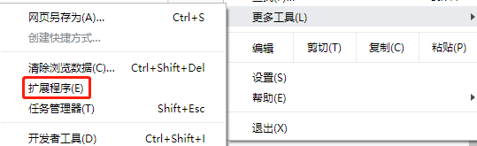
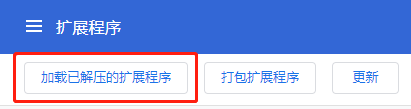
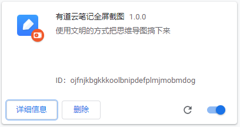
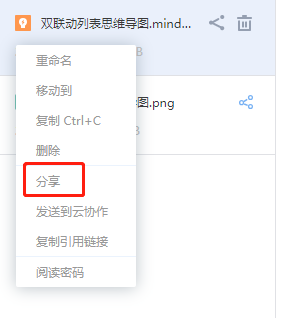
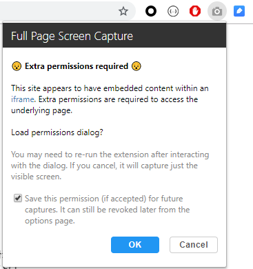

# youdao-note-export-png
## 有道云笔记不需要开通会员即可导出思维导图的方法

辛辛苦苦在有道云画了个思维导图，想要导出成png放到markdown文档里面做引用，结果发现居然要开会员，开了会员还要整天给我报500

于是我从网上扒拉了别人写的代码（2019年最后更新），并且加以修正，形成了这个插件

基础项目地址：https://github.com/niklasvh/html2canvas

1. 有道云笔记全屏插件(本仓库插件)
2. Full Page Screen Capture(用于chrome截长屏,且适用于iframe内的页面截图，牛逼)

2021-09-14 添加直接下载使用，可以在编辑模式下直接下载

预览下使用过程详细:

1.打开chrome，点击右上角三个点，选择 更多工具->扩展程序

2.打开扩展程序页面，右上角点击开发者模式

3.再看左上角，点击加载已解压的扩展程序

4.选中本仓库的testNote目录，点击确定加载，然后扩展程序中就会多出一个有道云笔记全屏截图的插件

5.进入有道云笔记，选择已经画好的思维导图，右键点击分享

6.生成分享链接后查看该分享链接，会看到右上角有个蓝色的保存按钮，已经变成全屏按钮了

7.点击这个全屏按钮，思维导图会直接放大到到全屏，并自动以png形式保存图片

8.点击确定截图完成，记得截图前把浏览器放大到全屏，这样清晰度就比较理想了，最后把图片保存成png，我就不截图了，Full Page Screen Capture 就那么几个按钮。。

**最后最后，偷偷说一句，markdown的页面也可以用这种方式保存成pdf哦，依然是这两个插件配合使用，使用方式跟上面8点一致**